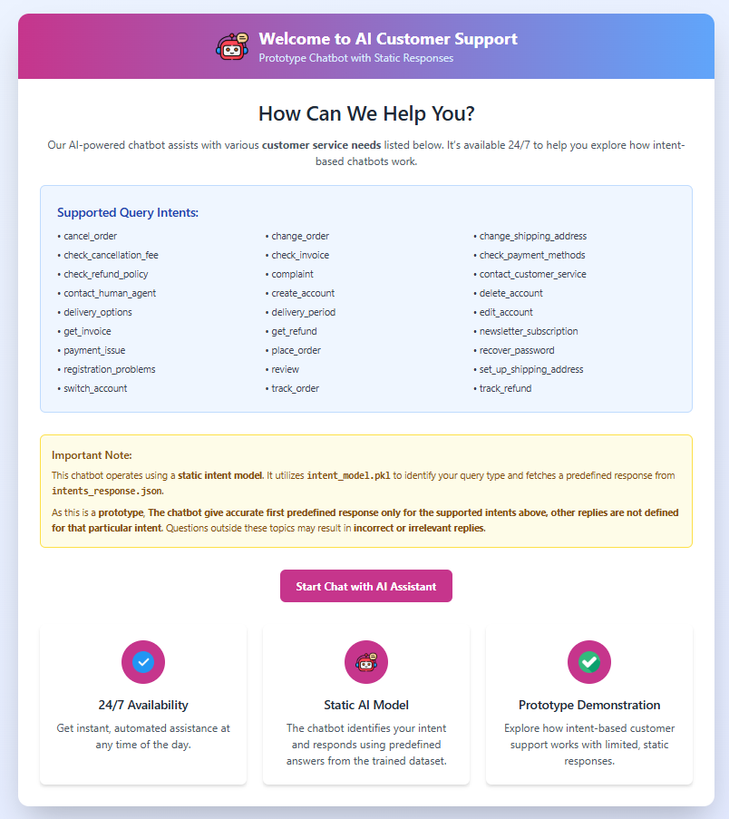
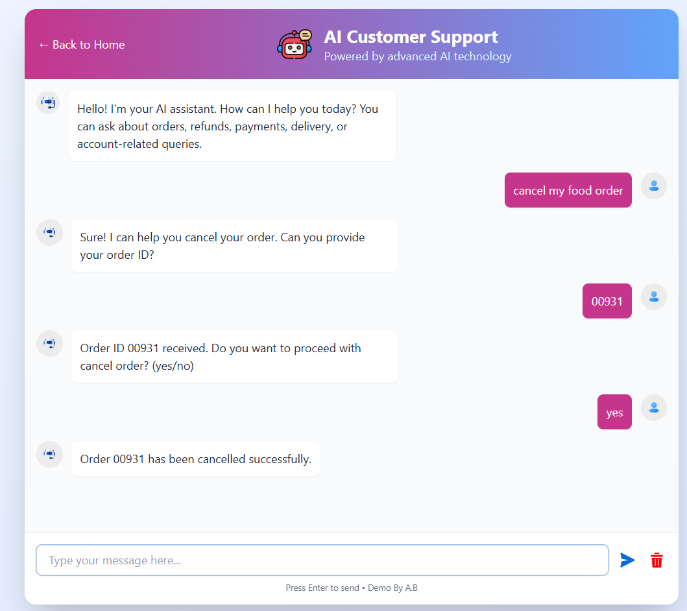

## Intent-Classification-Chatbot-Flask
AI-powered customer service chatbot built with Flask and NLP (TF-IDF + Logistic Regression). Detects user intents like order cancellation, refunds and payment issues etc with 99%+ accuracy.




## 🧠 AI Customer Service Chatbot ( Intent Classification + Flask Web App)

### 🎯 Major Goal
Build an **end-to-end AI-powered chatbot** that can automatically understand customer queries (intents) such as: Cancel Order, Track Refund, Payment Issue etc, and respond intelligently using a trained **NLP + ML model**.

---
### 🧩 Project Overview
This project demonstrates how AI can assist customer support by:

- 🧠 Understanding user messages using NLP  
- 🤖 Predicting intent using a trained **Logistic Regression** model  
- 💬 Linking each intent to a predefined response (mini chatbot)  
- 🧾 Handling multi-step queries with **slot filling** (e.g., asking for order ID)  
- 🌐 Providing a live **Flask web interface** for interaction  

---
### 🧱 Tech Stack

| Component | Purpose |
|------------|----------|
| **Python** | Core programming language |
| **Flask** | Web server and chatbot UI |
| **scikit-learn** | Machine learning (Logistic Regression) |
| **TF-IDF Vectorizer** | Text → Numeric features |
| **HTML/CSS/JS** | Frontend interface |
| **JSON** | Intent-response mapping |

---
### 🧠 Model Details

| Model | Type | Accuracy |
|--------|------|-----------|
| **Intent Classifier** | Logistic Regression (TF-IDF) | ~99.31% |

---
### ⚙️ How It Works

#### 1️⃣ User Enters Message
Example:  
> “I want to cancel my order”

#### 2️⃣ Text Preprocessing & Vectorization
User text is cleaned and converted into a **TF-IDF vector**.

#### 3️⃣ Intent Classification
The trained model predicts:  
> `cancel_order`

#### 4️⃣ Response Mapping
The chatbot retrieves the corresponding response from `intents_responses.json`.

#### 5️⃣ Conversation Flow
If the intent requires extra info (e.g., order ID), the bot dynamically asks for it handled via **slot extraction** and **simulated backend**.

---
### 📂 Project Folder Structuree
```
Customer-Service Chatbot/
├── app.py                          # Main Flask application with routes and chatbot logic
├── simulated_backend.py            # Simulated backend actions for order operations
├── slot_extraction.py              # Module for extracting order IDs from user messages
├── dataset/                        # Directory containing training data
│   └── Bitext_Sample_Customer_Support_Training_Dataset_27K_responses-v11.csv  # Training dataset
├── json/                           # Directory for JSON configuration files
│   └── intents_responses.json      # JSON file containing intent-response mappings
├── model/                          # Directory for machine learning models
│   ├── intent_model.pkl            # Trained machine learning model for intent classification
│   └── Customer-Service Intent classifer.ipynb  # Jupyter notebook for model training
├── templates/                      # HTML templates directory
│   ├── index.html                  # Home page with project information and chatbot access
│   └── chatbot.html                # Chatbot interface with conversation UI
```
#### 🚀 Run Locally
Clone the project
```
https://github.com/Ar-jun-fs9/Intent-Classification-Chatbot-Flask.git
cd Intent-Classification-Chatbot-Flask
````
#### install dependencies
```
pip install -r requirements.txt
````
#### Run the script
```
python app.py
```

